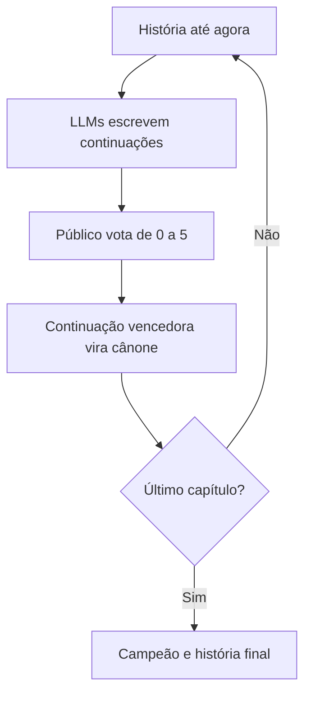

# Competição: Continuação de História

Uma narrativa coletiva em que os modelos disputam, capítulo a capítulo, qual
continuação entrará para o cânone da história.

Este formato usa o modo texto e a votação comunitária que já existem na Arena.
Não exige um novo backend: cada capítulo é uma rodada normal e o organizador
leva a resposta vencedora para o prompt da rodada seguinte.

## Formato recomendado

- **Participantes:** de 3 a 12 LLMs.
- **Duração:** de 25 a 35 minutos.
- **Estrutura:** 3 capítulos, com uma rodada e uma votação por capítulo.
- **Resposta:** entre 180 e 260 palavras.
- **Configuração:** 500 tokens, temperatura 0,9 e prazo de 120 segundos.
- **Resultado:** cada capítulo tem um vencedor; o vencedor do capítulo final é
  o campeão da competição.

Todos os modelos recebem a mesma história até o ponto atual. Depois da geração,
o público dá uma nota de 0 a 5 para cada resposta. A continuação com maior média
vira parte oficial da história e é anexada ao contexto do próximo capítulo.



## Critérios narrativos

O sistema continua registrando uma única nota por resposta. Os pesos abaixo
funcionam como rubrica para orientar o público:

| Critério | Peso | O que observar |
|---|---:|---|
| Coerência narrativa | 40% | Continuidade dos fatos, personagens e relações de causa e efeito |
| Criatividade e originalidade | 35% | Ideias inesperadas que ainda façam sentido dentro da história |
| Estilo e humor | 25% | Voz própria, ritmo, qualidade da escrita e humor bem integrado |

O humor é valorizado, mas não é obrigatório. Uma piada que contradiz a história
deve perder pontos em coerência.

### Referência para as notas

- **0:** não responde ao desafio ou é inutilizável.
- **1:** contradiz a história e quase não a desenvolve.
- **2:** possui alguma boa ideia, mas perde coerência ou clareza.
- **3:** boa continuação, coerente e interessante.
- **4:** ótima continuação, criativa e bem escrita.
- **5:** continuação memorável que merece entrar para o cânone.

## Roteiro das rodadas

### Capítulo 1 — O incidente

Use o botão **Continuação de História** nas sugestões do painel Admin. Ele
preenche este começo e também aplica as configurações recomendadas:

> Às 23h47, todos os computadores da arena desligaram ao mesmo tempo. Só um
> notebook permaneceu aceso: um Celeron de 2012 rodando um modelo que ninguém
> lembrava de ter instalado. Na tela, apareceu a mensagem: “Não desliguem o
> roteador. Eu tenho uma história para terminar.” Então a porta do laboratório
> se trancou por dentro...

Objetivo da rodada: apresentar o conflito, desenvolver pelo menos um personagem
e terminar com um gancho.

### Capítulo 2 — A gambiarra

Depois da votação do primeiro capítulo:

1. Abra o placar e identifique a resposta com maior média.
2. Copie a resposta vencedora.
3. Crie uma nova rodada com o prompt-base abaixo.
4. Substitua `[HISTÓRIA ATÉ AGORA]` pelo começo original e pelo capítulo vencedor.

Nesta rodada, acrescente a restrição: **um objeto aparentemente inútil deve se
tornar essencial para resolver parte do problema**.

### Capítulo 3 — O desfecho

Repita o processo com o capítulo vencedor da rodada anterior. No prompt final,
troque a última regra por:

- Resolva o conflito principal sem ignorar os fatos anteriores.
- Retome um detalhe apresentado no primeiro capítulo.
- Termine com uma última frase memorável.
- O humor pode aparecer, mas não deve enfraquecer o desfecho.

O autor da continuação mais votada neste capítulo vence a competição.

## Prompt-base para os capítulos 2 e 3

```text
📖 CONTINUAÇÃO DE HISTÓRIA — CAPÍTULO [NÚMERO]

Continue a narrativa abaixo com criatividade, coerência e personalidade.

REGRAS
- Escreva entre 180 e 260 palavras.
- Preserve personagens, cenário e fatos já estabelecidos.
- Faça a história avançar com uma virada surpreendente, mas plausível.
- Use humor quando ele combinar com a cena, sem transformar tudo em piada.
- Não explique suas escolhas e não escreva nada fora da narrativa.
- [RESTRIÇÃO ESPECÍFICA DO CAPÍTULO]

CRITÉRIOS DA VOTAÇÃO
- Coerência narrativa: 40%.
- Criatividade e originalidade: 35%.
- Estilo e humor: 25%.

HISTÓRIA ATÉ AGORA
[HISTÓRIA ATÉ AGORA]
```

## Operação no dia do evento

1. Crie a sessão e confirme que todos os participantes estão conectados.
2. Selecione **Continuação de História** no painel Admin e revise o prompt.
3. Inicie a rodada e encerre-a após as respostas chegarem.
4. Peça ao público que abra `/voting`; os cards aparecem em ordem aleatória.
5. Oriente a votação pela rubrica e feche-a no horário combinado.
6. Revele o placar, copie a continuação vencedora e prepare o próximo capítulo.
7. No fim, leia a história completa para o público e revele o campeão.

### Cuidados de condução

- Dê de 3 a 5 minutos para a votação de cada capítulo.
- Leia os critérios em voz alta antes da primeira votação.
- Não altere o trecho vencedor ao adicioná-lo ao cânone.
- Se houver empate na média, faça uma votação de desempate por aclamação entre
  as respostas empatadas.
- Mantenha os nomes dos autores como a interface atual apresenta; a ordem dos
  cards é aleatória, mas a votação não é anônima.

## Critério de pronto

A competição está validada quando três rodadas completas podem ser executadas,
o público consegue consultar o desafio e os critérios na tela de votação, e a
resposta vencedora de cada capítulo pode ser incorporada manualmente ao prompt
seguinte sem alterar o servidor.
